# Games

<html>
<head>
<link rel="stylesheet" type="text/css" href="../sitestyle.css" name="Games">

</head>
<body>
<h1 align=center>Puzzle Collection</h1>

<h2>Introduction</h2>

<h2>The games</h2>

The actual games in this collection were mostly not my invention;
they are re-implementations of existing game concepts within my
portable puzzle framework. I do not claim credit, in general, for
inventing the rules of any of these puzzles. (I don't even claim
authorship of all the code; some of the puzzles below have been
submitted by other authors.)

<table><tr><th align="center">Black Box</th></tr><tr><td align="center"></td><tr><td align="center">Find the hidden balls in the box by bouncing laser beams off them.</td></tr></table>
<table><tr><th align="center">Bridges</th></tr><tr><td align="center"><a href="js/bridges.html">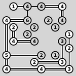</a></td></tr><tr><td align="center" style="font-size: 70%"><code>[</code> <a href="java/bridges.html">java</a> | <a href="js/bridges.html">js</a> | <a href="doc/bridges.html#bridges">manual</a> <code>]</code> <code>[</code> <a href="bridges.exe"><code>bridges.exe</code></a> <code>]</code></td></tr><tr><td align="center">Connect all the islands with a network of bridges.</td></tr></table>
<table><tr><th align="center">Cube</th></tr><tr><td align="center"><a href="js/cube.html">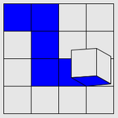</a></td></tr><tr><td align="center" style="font-size: 70%"><code>[</code> <a href="java/cube.html">java</a> | <a href="js/cube.html">js</a> | <a href="doc/cube.html#cube">manual</a> <code>]</code> <code>[</code> <a href="cube.exe"><code>cube.exe</code></a> <code>]</code></td></tr><tr><td align="center">Pick up all the blue squares by rolling the cube over them.</td></tr></table>
<table><tr><th align="center">Dominosa</th></tr><tr><td align="center"><a href="js/dominosa.html">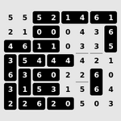</a></td></tr><tr><td align="center" style="font-size: 70%"><code>[</code> <a href="java/dominosa.html">java</a> | <a href="js/dominosa.html">js</a> | <a href="doc/dominosa.html#dominosa">manual</a> <code>]</code> <code>[</code> <a href="dominosa.exe"><code>dominosa.exe</code></a> <code>]</code></td></tr><tr><td align="center">Tile the rectangle with a full set of dominoes.</td></tr></table>
<table><tr><th align="center">Fifteen</th></tr><tr><td align="center"><a href="js/fifteen.html">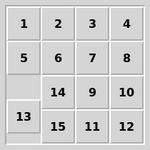</a></td></tr><tr><td align="center" style="font-size: 70%"><code>[</code> <a href="java/fifteen.html">java</a> | <a href="js/fifteen.html">js</a> | <a href="doc/fifteen.html#fifteen">manual</a> <code>]</code> <code>[</code> <a href="fifteen.exe"><code>fifteen.exe</code></a> <code>]</code></td></tr><tr><td align="center">Slide the tiles around to arrange them into order.</td></tr></table>
<table><tr><th align="center">Filling</th></tr><tr><td align="center"><a href="js/filling.html">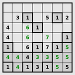</a></td></tr><tr><td align="center" style="font-size: 70%"><code>[</code> <a href="java/filling.html">java</a> | <a href="js/filling.html">js</a> | <a href="doc/filling.html#filling">manual</a> <code>]</code> <code>[</code> <a href="filling.exe"><code>filling.exe</code></a> <code>]</code></td></tr><tr><td align="center">Mark every square with the area of its containing region.</td></tr></table>
<table><tr><th align="center">Flip</th></tr><tr><td align="center"><a href="js/flip.html">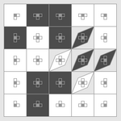</a></td></tr><tr><td align="center" style="font-size: 70%"><code>[</code> <a href="java/flip.html">java</a> | <a href="js/flip.html">js</a> | <a href="doc/flip.html#flip">manual</a> <code>]</code> <code>[</code> <a href="flip.exe"><code>flip.exe</code></a> <code>]</code></td></tr><tr><td align="center">Flip groups of squares to light them all up at once.</td></tr></table>
<table><tr><th align="center">Flood</th></tr><tr><td align="center"><a href="js/flood.html">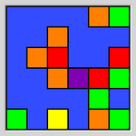</a></td></tr><tr><td align="center" style="font-size: 70%"><code>[</code> <a href="java/flood.html">java</a> | <a href="js/flood.html">js</a> | <a href="doc/flood.html#flood">manual</a> <code>]</code> <code>[</code> <a href="flood.exe"><code>flood.exe</code></a> <code>]</code></td></tr><tr><td align="center">Turn the grid the same colour in as few flood fills as possible.</td></tr></table>
<table><tr><th align="center">Galaxies</th></tr><tr><td align="center"><a href="js/galaxies.html">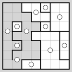</a></td></tr><tr><td align="center" style="font-size: 70%"><code>[</code> <a href="java/galaxies.html">java</a> | <a href="js/galaxies.html">js</a> | <a href="doc/galaxies.html#galaxies">manual</a> <code>]</code> <code>[</code> <a href="galaxies.exe"><code>galaxies.exe</code></a> <code>]</code></td></tr><tr><td align="center">Divide the grid into rotationally symmetric regions each centred on a dot.</td></tr></table>
<table><tr><th align="center">Guess</th></tr><tr><td align="center"><a href="js/guess.html">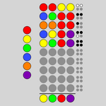</a></td></tr><tr><td align="center" style="font-size: 70%"><code>[</code> <a href="java/guess.html">java</a> | <a href="js/guess.html">js</a> | <a href="doc/guess.html#guess">manual</a> <code>]</code> <code>[</code> <a href="guess.exe"><code>guess.exe</code></a> <code>]</code></td></tr><tr><td align="center">Guess the hidden combination of colours.</td></tr></table>
<table><tr><th align="center">Inertia</th></tr><tr><td align="center"><a href="js/inertia.html">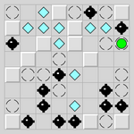</a></td></tr><tr><td align="center" style="font-size: 70%"><code>[</code> <a href="java/inertia.html">java</a> | <a href="js/inertia.html">js</a> | <a href="doc/inertia.html#inertia">manual</a> <code>]</code> <code>[</code> <a href="inertia.exe"><code>inertia.exe</code></a> <code>]</code></td></tr><tr><td align="center">Collect all the gems without running into any of the mines.</td></tr></table>
<table><tr><th align="center">Keen</th></tr><tr><td align="center"><a href="js/keen.html">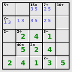</a></td></tr><tr><td align="center" style="font-size: 70%"><code>[</code> <a href="java/keen.html">java</a> | <a href="js/keen.html">js</a> | <a href="doc/keen.html#keen">manual</a> <code>]</code> <code>[</code> <a href="keen.exe"><code>keen.exe</code></a> <code>]</code></td></tr><tr><td align="center">Complete the latin square in accordance with the arithmetic clues.</td></tr></table>
<table><tr><th align="center">Light Up</th></tr><tr><td align="center"><a href="js/lightup.html">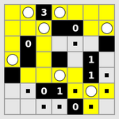</a></td></tr><tr><td align="center" style="font-size: 70%"><code>[</code> <a href="java/lightup.html">java</a> | <a href="js/lightup.html">js</a> | <a href="doc/lightup.html#lightup">manual</a> <code>]</code> <code>[</code> <a href="lightup.exe"><code>lightup.exe</code></a> <code>]</code></td></tr><tr><td align="center">Place bulbs to light up all the squares.</td></tr></table>
<table><tr><th align="center">Loopy</th></tr><tr><td align="center"><a href="js/loopy.html">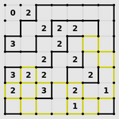</a></td></tr><tr><td align="center" style="font-size: 70%"><code>[</code> <a href="java/loopy.html">java</a> | <a href="js/loopy.html">js</a> | <a href="doc/loopy.html#loopy">manual</a> <code>]</code> <code>[</code> <a href="loopy.exe"><code>loopy.exe</code></a> <code>]</code></td></tr><tr><td align="center">Draw a single closed loop, given clues about number of adjacent edges.</td></tr></table>
<table><tr><th align="center">Magnets</th></tr><tr><td align="center"><a href="js/magnets.html">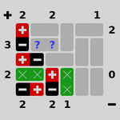</a></td></tr><tr><td align="center" style="font-size: 70%"><code>[</code> <a href="java/magnets.html">java</a> | <a href="js/magnets.html">js</a> | <a href="doc/magnets.html#magnets">manual</a> <code>]</code> <code>[</code> <a href="magnets.exe"><code>magnets.exe</code></a> <code>]</code></td></tr><tr><td align="center">Place magnets to satisfy the clues and avoid like poles touching.</td></tr></table>
<table><tr><th align="center">Map</th></tr><tr><td align="center"><a href="js/map.html">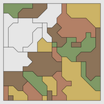</a></td></tr><tr><td align="center" style="font-size: 70%"><code>[</code> <a href="java/map.html">java</a> | <a href="js/map.html">js</a> | <a href="doc/map.html#map">manual</a> <code>]</code> <code>[</code> <a href="map.exe"><code>map.exe</code></a> <code>]</code></td></tr><tr><td align="center">Colour the map so that adjacent regions are never the same colour.</td></tr></table>
<table><tr><th align="center">Mines</th></tr><tr><td align="center"><a href="js/mines.html">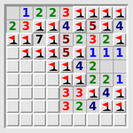</a></td></tr><tr><td align="center" style="font-size: 70%"><code>[</code> <a href="java/mines.html">java</a> | <a href="js/mines.html">js</a> | <a href="doc/mines.html#mines">manual</a> <code>]</code> <code>[</code> <a href="mines.exe"><code>mines.exe</code></a> <code>]</code></td></tr><tr><td align="center">Find all the mines without treading on any of them.</td></tr></table>
<table><tr><th align="center">Mosaic</th></tr><tr><td align="center"><a href="js/mosaic.html">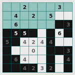</a></td></tr><tr><td align="center" style="font-size: 70%"><code>[</code> <a href="java/mosaic.html">java</a> | <a href="js/mosaic.html">js</a> | <a href="doc/mosaic.html#mosaic">manual</a> <code>]</code> <code>[</code> <a href="mosaic.exe"><code>mosaic.exe</code></a> <code>]</code></td></tr><tr><td align="center">Fill in the grid given clues about number of nearby black squares.</td></tr></table>
<table><tr><th align="center">Net</th></tr><tr><td align="center"><a href="js/net.html">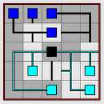</a></td></tr><tr><td align="center" style="font-size: 70%"><code>[</code> <a href="java/net.html">java</a> | <a href="js/net.html">js</a> | <a href="doc/net.html#net">manual</a> <code>]</code> <code>[</code> <a href="netgame.exe"><code>netgame.exe</code></a> <code>]</code></td></tr><tr><td align="center">Rotate each tile to reassemble the network.</td></tr></table>
<table><tr><th align="center">Netslide</th></tr><tr><td align="center"><a href="js/netslide.html">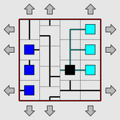</a></td></tr><tr><td align="center" style="font-size: 70%"><code>[</code> <a href="java/netslide.html">java</a> | <a href="js/netslide.html">js</a> | <a href="doc/netslide.html#netslide">manual</a> <code>]</code> <code>[</code> <a href="netslide.exe"><code>netslide.exe</code></a> <code>]</code></td></tr><tr><td align="center">Slide a row at a time to reassemble the network.</td></tr></table>
<table><tr><th align="center">Palisade</th></tr><tr><td align="center"><a href="js/palisade.html">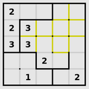</a></td></tr><tr><td align="center" style="font-size: 70%"><code>[</code> <a href="java/palisade.html">java</a> | <a href="js/palisade.html">js</a> | <a href="doc/palisade.html#palisade">manual</a> <code>]</code> <code>[</code> <a href="palisade.exe"><code>palisade.exe</code></a> <code>]</code></td></tr><tr><td align="center">Divide the grid into equal-sized areas in accordance with the clues.</td></tr></table>
<table><tr><th align="center">Pattern</th></tr><tr><td align="center"><a href="js/pattern.html">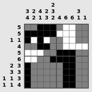</a></td></tr><tr><td align="center" style="font-size: 70%"><code>[</code> <a href="java/pattern.html">java</a> | <a href="js/pattern.html">js</a> | <a href="doc/pattern.html#pattern">manual</a> <code>]</code> <code>[</code> <a href="pattern.exe"><code>pattern.exe</code></a> <code>]</code></td></tr><tr><td align="center">Fill in the pattern in the grid, given only the lengths of runs of black squares.</td></tr></table>
<table><tr><th align="center">Pearl</th></tr><tr><td align="center"><a href="js/pearl.html">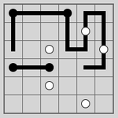</a></td></tr><tr><td align="center" style="font-size: 70%"><code>[</code> <a href="java/pearl.html">java</a> | <a href="js/pearl.html">js</a> | <a href="doc/pearl.html#pearl">manual</a> <code>]</code> <code>[</code> <a href="pearl.exe"><code>pearl.exe</code></a> <code>]</code></td></tr><tr><td align="center">Draw a single closed loop, given clues about corner and straight squares.</td></tr></table>
<table><tr><th align="center">Pegs</th></tr><tr><td align="center"><a href="js/pegs.html">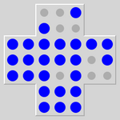</a></td></tr><tr><td align="center" style="font-size: 70%"><code>[</code> <a href="java/pegs.html">java</a> | <a href="js/pegs.html">js</a> | <a href="doc/pegs.html#pegs">manual</a> <code>]</code> <code>[</code> <a href="pegs.exe"><code>pegs.exe</code></a> <code>]</code></td></tr><tr><td align="center">Jump pegs over each other to remove all but one.</td></tr></table>
<table><tr><th align="center">Range</th></tr><tr><td align="center"><a href="js/range.html">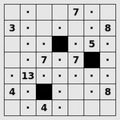</a></td></tr><tr><td align="center" style="font-size: 70%"><code>[</code> <a href="java/range.html">java</a> | <a href="js/range.html">js</a> | <a href="doc/range.html#range">manual</a> <code>]</code> <code>[</code> <a href="range.exe"><code>range.exe</code></a> <code>]</code></td></tr><tr><td align="center">Place black squares to limit the visible distance from each numbered cell.</td></tr></table>
<table><tr><th align="center">Rectangles</th></tr><tr><td align="center"><a href="js/rect.html">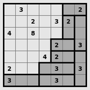</a></td></tr><tr><td align="center" style="font-size: 70%"><code>[</code> <a href="java/rect.html">java</a> | <a href="js/rect.html">js</a> | <a href="doc/rect.html#rect">manual</a> <code>]</code> <code>[</code> <a href="rect.exe"><code>rect.exe</code></a> <code>]</code></td></tr><tr><td align="center">Divide the grid into rectangles with areas equal to the numbers.</td></tr></table>
<table><tr><th align="center">Same Game</th></tr><tr><td align="center"><a href="js/samegame.html">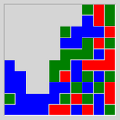</a></td></tr><tr><td align="center" style="font-size: 70%"><code>[</code> <a href="java/samegame.html">java</a> | <a href="js/samegame.html">js</a> | <a href="doc/samegame.html#samegame">manual</a> <code>]</code> <code>[</code> <a href="samegame.exe"><code>samegame.exe</code></a> <code>]</code></td></tr><tr><td align="center">Clear the grid by removing touching groups of the same colour squares.</td></tr></table>
<table><tr><th align="center">Signpost</th></tr><tr><td align="center"><a href="js/signpost.html">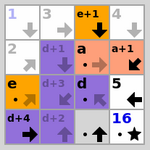</a></td></tr><tr><td align="center" style="font-size: 70%"><code>[</code> <a href="java/signpost.html">java</a> | <a href="js/signpost.html">js</a> | <a href="doc/signpost.html#signpost">manual</a> <code>]</code> <code>[</code> <a href="signpost.exe"><code>signpost.exe</code></a> <code>]</code></td></tr><tr><td align="center">Connect the squares into a path following the arrows.</td></tr></table>
<table><tr><th align="center">Singles</th></tr><tr><td align="center"><a href="js/singles.html">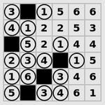</a></td></tr><tr><td align="center" style="font-size: 70%"><code>[</code> <a href="java/singles.html">java</a> | <a href="js/singles.html">js</a> | <a href="doc/singles.html#singles">manual</a> <code>]</code> <code>[</code> <a href="singles.exe"><code>singles.exe</code></a> <code>]</code></td></tr><tr><td align="center">Black out the right set of duplicate numbers.</td></tr></table>
<table><tr><th align="center">Sixteen</th></tr><tr><td align="center"><a href="js/sixteen.html">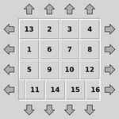</a></td></tr><tr><td align="center" style="font-size: 70%"><code>[</code> <a href="java/sixteen.html">java</a> | <a href="js/sixteen.html">js</a> | <a href="doc/sixteen.html#sixteen">manual</a> <code>]</code> <code>[</code> <a href="sixteen.exe"><code>sixteen.exe</code></a> <code>]</code></td></tr><tr><td align="center">Slide a row at a time to arrange the tiles into order.</td></tr></table>
<table><tr><th align="center">Slant</th></tr><tr><td align="center"><a href="js/slant.html">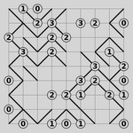</a></td></tr><tr><td align="center" style="font-size: 70%"><code>[</code> <a href="java/slant.html">java</a> | <a href="js/slant.html">js</a> | <a href="doc/slant.html#slant">manual</a> <code>]</code> <code>[</code> <a href="slant.exe"><code>slant.exe</code></a> <code>]</code></td></tr><tr><td align="center">Draw a maze of slanting lines that matches the clues.</td></tr></table>
<table><tr><th align="center">Solo</th></tr><tr><td align="center"><a href="js/solo.html">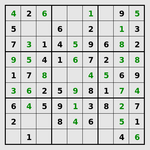</a></td></tr><tr><td align="center" style="font-size: 70%"><code>[</code> <a href="java/solo.html">java</a> | <a href="js/solo.html">js</a> | <a href="doc/solo.html#solo">manual</a> <code>]</code> <code>[</code> <a href="solo.exe"><code>solo.exe</code></a> <code>]</code></td></tr><tr><td align="center">Fill in the grid so that each row, column and square block contains one of every digit.</td></tr></table>
<table><tr><th align="center">Tents</th></tr><tr><td align="center"></td></tr><tr><td align="center" style="font-size: 70%"><code>[</code> <a href="java/tents.html">java</a> | <a href="js/tents.html">js</a> | <a href="doc/tents.html#tents">manual</a> <code>]</code> <code>[</code> <a href="tents.exe"><code>tents.exe</code></a> <code>]</code></td></tr><tr><td align="center">Place a tent next to each tree.</td></tr></table>
<table><tr><th align="center">Towers</th></tr><tr><td align="center"><a href="js/towers.html">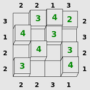</a></td></tr><tr><td align="center" style="font-size: 70%"><code>[</code> <a href="java/towers.html">java</a> | <a href="js/towers.html">js</a> | <a href="doc/towers.html#towers">manual</a> <code>]</code> <code>[</code> <a href="towers.exe"><code>towers.exe</code></a> <code>]</code></td></tr><tr><td align="center">Complete the latin square of towers in accordance with the clues.</td></tr></table>
<table><tr><th align="center">Tracks</th></tr><tr><td align="center"><a href="js/tracks.html">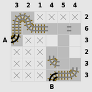</a></td></tr><tr><td align="center" style="font-size: 70%"><code>[</code> <a href="java/tracks.html">java</a> | <a href="js/tracks.html">js</a> | <a href="doc/tracks.html#tracks">manual</a> <code>]</code> <code>[</code> <a href="tracks.exe"><code>tracks.exe</code></a> <code>]</code></td></tr><tr><td align="center">Fill in the railway track according to the clues.</td></tr></table>
<table><tr><th align="center">Twiddle</th></tr><tr><td align="center"><a href="js/twiddle.html">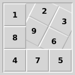</a></td></tr><tr><td align="center" style="font-size: 70%"><code>[</code> <a href="java/twiddle.html">java</a> | <a href="js/twiddle.html">js</a> | <a href="doc/twiddle.html#twiddle">manual</a> <code>]</code> <code>[</code> <a href="twiddle.exe"><code>twiddle.exe</code></a> <code>]</code></td></tr><tr><td align="center">Rotate the tiles around themselves to arrange them into order.</td></tr></table>
<table><tr><th align="center">Undead</th></tr><tr><td align="center"><a href="js/undead.html">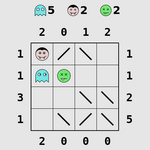</a></td></tr><tr><td align="center" style="font-size: 70%"><code>[</code> <a href="java/undead.html">java</a> | <a href="js/undead.html">js</a> | <a href="doc/undead.html#undead">manual</a> <code>]</code> <code>[</code> <a href="undead.exe"><code>undead.exe</code></a> <code>]</code></td></tr><tr><td align="center">Place ghosts, vampires and zombies so that the right numbers of them can be seen in mirrors.</td></tr></table>
<table><tr><th align="center">Unequal</th></tr><tr><td align="center"><a href="js/unequal.html">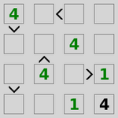</a></td></tr><tr><td align="center" style="font-size: 70%"><code>[</code> <a href="java/unequal.html">java</a> | <a href="js/unequal.html">js</a> | <a href="doc/unequal.html#unequal">manual</a> <code>]</code> <code>[</code> <a href="unequal.exe"><code>unequal.exe</code></a> <code>]</code></td></tr><tr><td align="center">Complete the latin square in accordance with the &gt; signs.</td></tr></table>
<table><tr><th align="center">Unruly</th></tr><tr><td align="center"><a href="js/unruly.html">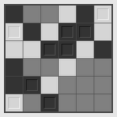</a></td></tr><tr><td align="center" style="font-size: 70%"><code>[</code> <a href="java/unruly.html">java</a> | <a href="js/unruly.html">js</a> | <a href="doc/unruly.html#unruly">manual</a> <code>]</code> <code>[</code> <a href="unruly.exe"><code>unruly.exe</code></a> <code>]</code></td></tr><tr><td align="center">Fill in the black and white grid to avoid runs of three.</td></tr></table>
<table><tr><th align="center">Untangle</th></tr><tr><td align="center"><a href="js/untangle.html">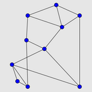</a></td></tr><tr><td align="center" style="font-size: 70%"><code>[</code> <a href="java/untangle.html">java</a> | <a href="js/untangle.html">js</a> | <a href="doc/untangle.html#untangle">manual</a> <code>]</code> <code>[</code> <a href="untangle.exe"><code>untangle.exe</code></a> <code>]</code></td></tr><tr><td align="center">Reposition the points so that the lines do not cross.</td></tr></table>

</body>
</html>

