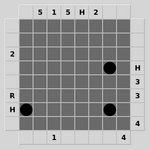
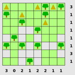

# games

<html>
<head>
<title>Simon Tatham's Portable Puzzle Collection</title>
<link rel="stylesheet" type="text/css" href="../sitestyle.css" name="Simon Tatham's Home Page Style">

</head>
<body>
<h1 align=center>Simon Tatham's Portable Puzzle Collection</h1>

<h2>Introduction</h2>

This page contains a collection of small computer programs which
implement one-player puzzle games. All of them run natively on Unix
(GTK) and on Windows. They can also be played on the web, as Java or
Javascript applets.

2023-09-20: I'm sorry to say that I'm no
longer going to be able to build the MacOS version of these puzzles.
My Mac was very old and had been struggling for a while; it's now
stopped working, and I don't intend to buy a new one. If someone else
would like to volunteer to maintain the Mac front end code and provide
a downloadable application, I'll help them get started, and link to
their site once it's up and running. Sorry, Mac users. In the
meantime, there's always the web version...

I wrote this collection because I thought there should be more small
desktop toys available: little games you can pop up in a window and
play for two or three minutes while you take a break from whatever
else you were doing. And I was also annoyed that every time I found a
good game on (say) Unix, it wasn't available the next time I was
sitting at a Windows machine, or vice versa; so I arranged that
everything in my personal puzzle collection will happily run on both
those platforms and more. When I find (or perhaps invent) further
puzzle games that I like, they'll be added to this collection and will
immediately be available on both platforms. And if anyone feels like
writing any other front ends for platforms I don't support (which
people already have) then all the games in this framework will
immediately become available on another platform as well.

<h2>The games</h2>

The actual games in this collection were mostly not my invention;
they are re-implementations of existing game concepts within my
portable puzzle framework. I do not claim credit, in general, for
inventing the rules of any of these puzzles. (I don't even claim
authorship of all the code; some of the puzzles below have been
submitted by other authors.)

Below each image are two links to versions of the puzzle you can
potentially play on the web. The 'js' link (and also the puzzle image
itself) links to a version based on JavaScript and WebAssembly. The
'java' link is now probably obsolete: it links to a Java applet, which
most browsers don't support any more.

Also below each image is a link to the Windows binary for the game,
and a link to the manual. For all other platforms, the games are
provided in a single bundle, so scroll down to the
<a href="#download">Download</a>
section to get them all.

<table><tr><th align="center">Black Box</th></tr><tr><td align="center"></td></tr><tr><td align="center" style="font-size: 70%"><code>[</code> <a href="java/blackbox.html">java</a> | <a href="js/blackbox.html">js</a> | <a href="doc/blackbox.html#blackbox">manual</a> <code>]</code> <code>[</code> <a href="blackbox.exe"><code>blackbox.exe</code></a> <code>]</code></td></tr><tr><td align="center">Find the hidden balls in the box by bouncing laser beams off them.</td></tr></table>
<table><tr><th align="center">Bridges</th></tr><tr><td align="center"></td></tr><tr><td align="center" style="font-size: 70%"><code>[</code> <a href="java/bridges.html">java</a> | <a href="js/bridges.html">js</a> | <a href="doc/bridges.html#bridges">manual</a> <code>]</code> <code>[</code> <a href="bridges.exe"><code>bridges.exe</code></a> <code>]</code></td></tr><tr><td align="center">Connect all the islands with a network of bridges.</td></tr></table>
<table><tr><th align="center">Cube</th></tr><tr><td align="center"></td></tr><tr><td align="center" style="font-size: 70%"><code>[</code> <a href="java/cube.html">java</a> | <a href="js/cube.html">js</a> | <a href="doc/cube.html#cube">manual</a> <code>]</code> <code>[</code> <a href="cube.exe"><code>cube.exe</code></a> <code>]</code></td></tr><tr><td align="center">Pick up all the blue squares by rolling the cube over them.</td></tr></table>
<table><tr><th align="center">Dominosa</th></tr><tr><td align="center"></td></tr><tr><td align="center" style="font-size: 70%"><code>[</code> <a href="java/dominosa.html">java</a> | <a href="js/dominosa.html">js</a> | <a href="doc/dominosa.html#dominosa">manual</a> <code>]</code> <code>[</code> <a href="dominosa.exe"><code>dominosa.exe</code></a> <code>]</code></td></tr><tr><td align="center">Tile the rectangle with a full set of dominoes.</td></tr></table>
<table><tr><th align="center">Fifteen</th></tr><tr><td align="center"></td></tr><tr><td align="center" style="font-size: 70%"><code>[</code> <a href="java/fifteen.html">java</a> | <a href="js/fifteen.html">js</a> | <a href="doc/fifteen.html#fifteen">manual</a> <code>]</code> <code>[</code> <a href="fifteen.exe"><code>fifteen.exe</code></a> <code>]</code></td></tr><tr><td align="center">Slide the tiles around to arrange them into order.</td></tr></table>
<table><tr><th align="center">Filling</th></tr><tr><td align="center"></td></tr><tr><td align="center" style="font-size: 70%"><code>[</code> <a href="java/filling.html">java</a> | <a href="js/filling.html">js</a> | <a href="doc/filling.html#filling">manual</a> <code>]</code> <code>[</code> <a href="filling.exe"><code>filling.exe</code></a> <code>]</code></td></tr><tr><td align="center">Mark every square with the area of its containing region.</td></tr></table>
<table><tr><th align="center">Flip</th></tr><tr><td align="center"></td></tr><tr><td align="center" style="font-size: 70%"><code>[</code> <a href="java/flip.html">java</a> | <a href="js/flip.html">js</a> | <a href="doc/flip.html#flip">manual</a> <code>]</code> <code>[</code> <a href="flip.exe"><code>flip.exe</code></a> <code>]</code></td></tr><tr><td align="center">Flip groups of squares to light them all up at once.</td></tr></table>
<table><tr><th align="center">Flood</th></tr><tr><td align="center"></td></tr><tr><td align="center" style="font-size: 70%"><code>[</code> <a href="java/flood.html">java</a> | <a href="js/flood.html">js</a> | <a href="doc/flood.html#flood">manual</a> <code>]</code> <code>[</code> <a href="flood.exe"><code>flood.exe</code></a> <code>]</code></td></tr><tr><td align="center">Turn the grid the same colour in as few flood fills as possible.</td></tr></table>
<table><tr><th align="center">Galaxies</th></tr><tr><td align="center"></td></tr><tr><td align="center" style="font-size: 70%"><code>[</code> <a href="java/galaxies.html">java</a> | <a href="js/galaxies.html">js</a> | <a href="doc/galaxies.html#galaxies">manual</a> <code>]</code> <code>[</code> <a href="galaxies.exe"><code>galaxies.exe</code></a> <code>]</code></td></tr><tr><td align="center">Divide the grid into rotationally symmetric regions each centred on a dot.</td></tr></table>
<table><tr><th align="center">Guess</th></tr><tr><td align="center"></td></tr><tr><td align="center" style="font-size: 70%"><code>[</code> <a href="java/guess.html">java</a> | <a href="js/guess.html">js</a> | <a href="doc/guess.html#guess">manual</a> <code>]</code> <code>[</code> <a href="guess.exe"><code>guess.exe</code></a> <code>]</code></td></tr><tr><td align="center">Guess the hidden combination of colours.</td></tr></table>
<table><tr><th align="center">Inertia</th></tr><tr><td align="center"></td></tr><tr><td align="center" style="font-size: 70%"><code>[</code> <a href="java/inertia.html">java</a> | <a href="js/inertia.html">js</a> | <a href="doc/inertia.html#inertia">manual</a> <code>]</code> <code>[</code> <a href="inertia.exe"><code>inertia.exe</code></a> <code>]</code></td></tr><tr><td align="center">Collect all the gems without running into any of the mines.</td></tr></table>
<table><tr><th align="center">Keen</th></tr><tr><td align="center"></td></tr><tr><td align="center" style="font-size: 70%"><code>[</code> <a href="java/keen.html">java</a> | <a href="js/keen.html">js</a> | <a href="doc/keen.html#keen">manual</a> <code>]</code> <code>[</code> <a href="keen.exe"><code>keen.exe</code></a> <code>]</code></td></tr><tr><td align="center">Complete the latin square in accordance with the arithmetic clues.</td></tr></table>
<table><tr><th align="center">Light Up</th></tr><tr><td align="center"></td></tr><tr><td align="center" style="font-size: 70%"><code>[</code> <a href="java/lightup.html">java</a> | <a href="js/lightup.html">js</a> | <a href="doc/lightup.html#lightup">manual</a> <code>]</code> <code>[</code> <a href="lightup.exe"><code>lightup.exe</code></a> <code>]</code></td></tr><tr><td align="center">Place bulbs to light up all the squares.</td></tr></table>
<table><tr><th align="center">Loopy</th></tr><tr><td align="center"></td></tr><tr><td align="center" style="font-size: 70%"><code>[</code> <a href="java/loopy.html">java</a> | <a href="js/loopy.html">js</a> | <a href="doc/loopy.html#loopy">manual</a> <code>]</code> <code>[</code> <a href="loopy.exe"><code>loopy.exe</code></a> <code>]</code></td></tr><tr><td align="center">Draw a single closed loop, given clues about number of adjacent edges.</td></tr></table>
<table><tr><th align="center">Magnets</th></tr><tr><td align="center"></td></tr><tr><td align="center" style="font-size: 70%"><code>[</code> <a href="java/magnets.html">java</a> | <a href="js/magnets.html">js</a> | <a href="doc/magnets.html#magnets">manual</a> <code>]</code> <code>[</code> <a href="magnets.exe"><code>magnets.exe</code></a> <code>]</code></td></tr><tr><td align="center">Place magnets to satisfy the clues and avoid like poles touching.</td></tr></table>
<table><tr><th align="center">Map</th></tr><tr><td align="center"></td></tr><tr><td align="center" style="font-size: 70%"><code>[</code> <a href="java/map.html">java</a> | <a href="js/map.html">js</a> | <a href="doc/map.html#map">manual</a> <code>]</code> <code>[</code> <a href="map.exe"><code>map.exe</code></a> <code>]</code></td></tr><tr><td align="center">Colour the map so that adjacent regions are never the same colour.</td></tr></table>
<table><tr><th align="center">Mines</th></tr><tr><td align="center"></td></tr><tr><td align="center" style="font-size: 70%"><code>[</code> <a href="java/mines.html">java</a> | <a href="js/mines.html">js</a> | <a href="doc/mines.html#mines">manual</a> <code>]</code> <code>[</code> <a href="mines.exe"><code>mines.exe</code></a> <code>]</code></td></tr><tr><td align="center">Find all the mines without treading on any of them.</td></tr></table>
<table><tr><th align="center">Mosaic</th></tr><tr><td align="center"></td></tr><tr><td align="center" style="font-size: 70%"><code>[</code> <a href="java/mosaic.html">java</a> | <a href="js/mosaic.html">js</a> | <a href="doc/mosaic.html#mosaic">manual</a> <code>]</code> <code>[</code> <a href="mosaic.exe"><code>mosaic.exe</code></a> <code>]</code></td></tr><tr><td align="center">Fill in the grid given clues about number of nearby black squares.</td></tr></table>
<table><tr><th align="center">Net</th></tr><tr><td align="center"></td></tr><tr><td align="center" style="font-size: 70%"><code>[</code> <a href="java/net.html">java</a> | <a href="js/net.html">js</a> | <a href="doc/net.html#net">manual</a> <code>]</code> <code>[</code> <a href="netgame.exe"><code>netgame.exe</code></a> <code>]</code></td></tr><tr><td align="center">Rotate each tile to reassemble the network.</td></tr></table>
<table><tr><th align="center">Netslide</th></tr><tr><td align="center"></td></tr><tr><td align="center" style="font-size: 70%"><code>[</code> <a href="java/netslide.html">java</a> | <a href="js/netslide.html">js</a> | <a href="doc/netslide.html#netslide">manual</a> <code>]</code> <code>[</code> <a href="netslide.exe"><code>netslide.exe</code></a> <code>]</code></td></tr><tr><td align="center">Slide a row at a time to reassemble the network.</td></tr></table>
<table><tr><th align="center">Palisade</th></tr><tr><td align="center"></td></tr><tr><td align="center" style="font-size: 70%"><code>[</code> <a href="java/palisade.html">java</a> | <a href="js/palisade.html">js</a> | <a href="doc/palisade.html#palisade">manual</a> <code>]</code> <code>[</code> <a href="palisade.exe"><code>palisade.exe</code></a> <code>]</code></td></tr><tr><td align="center">Divide the grid into equal-sized areas in accordance with the clues.</td></tr></table>
<table><tr><th align="center">Pattern</th></tr><tr><td align="center"></td></tr><tr><td align="center" style="font-size: 70%"><code>[</code> <a href="java/pattern.html">java</a> | <a href="js/pattern.html">js</a> | <a href="doc/pattern.html#pattern">manual</a> <code>]</code> <code>[</code> <a href="pattern.exe"><code>pattern.exe</code></a> <code>]</code></td></tr><tr><td align="center">Fill in the pattern in the grid, given only the lengths of runs of black squares.</td></tr></table>
<table><tr><th align="center">Pearl</th></tr><tr><td align="center"></td></tr><tr><td align="center" style="font-size: 70%"><code>[</code> <a href="java/pearl.html">java</a> | <a href="js/pearl.html">js</a> | <a href="doc/pearl.html#pearl">manual</a> <code>]</code> <code>[</code> <a href="pearl.exe"><code>pearl.exe</code></a> <code>]</code></td></tr><tr><td align="center">Draw a single closed loop, given clues about corner and straight squares.</td></tr></table>
<table><tr><th align="center">Pegs</th></tr><tr><td align="center"></td></tr><tr><td align="center" style="font-size: 70%"><code>[</code> <a href="java/pegs.html">java</a> | <a href="js/pegs.html">js</a> | <a href="doc/pegs.html#pegs">manual</a> <code>]</code> <code>[</code> <a href="pegs.exe"><code>pegs.exe</code></a> <code>]</code></td></tr><tr><td align="center">Jump pegs over each other to remove all but one.</td></tr></table>
<table><tr><th align="center">Range</th></tr><tr><td align="center"></td></tr><tr><td align="center" style="font-size: 70%"><code>[</code> <a href="java/range.html">java</a> | <a href="js/range.html">js</a> | <a href="doc/range.html#range">manual</a> <code>]</code> <code>[</code> <a href="range.exe"><code>range.exe</code></a> <code>]</code></td></tr><tr><td align="center">Place black squares to limit the visible distance from each numbered cell.</td></tr></table>
<table><tr><th align="center">Rectangles</th></tr><tr><td align="center"></td></tr><tr><td align="center" style="font-size: 70%"><code>[</code> <a href="java/rect.html">java</a> | <a href="js/rect.html">js</a> | <a href="doc/rect.html#rect">manual</a> <code>]</code> <code>[</code> <a href="rect.exe"><code>rect.exe</code></a> <code>]</code></td></tr><tr><td align="center">Divide the grid into rectangles with areas equal to the numbers.</td></tr></table>
<table><tr><th align="center">Same Game</th></tr><tr><td align="center"></td></tr><tr><td align="center" style="font-size: 70%"><code>[</code> <a href="java/samegame.html">java</a> | <a href="js/samegame.html">js</a> | <a href="doc/samegame.html#samegame">manual</a> <code>]</code> <code>[</code> <a href="samegame.exe"><code>samegame.exe</code></a> <code>]</code></td></tr><tr><td align="center">Clear the grid by removing touching groups of the same colour squares.</td></tr></table>
<table><tr><th align="center">Signpost</th></tr><tr><td align="center"></td></tr><tr><td align="center" style="font-size: 70%"><code>[</code> <a href="java/signpost.html">java</a> | <a href="js/signpost.html">js</a> | <a href="doc/signpost.html#signpost">manual</a> <code>]</code> <code>[</code> <a href="signpost.exe"><code>signpost.exe</code></a> <code>]</code></td></tr><tr><td align="center">Connect the squares into a path following the arrows.</td></tr></table>
<table><tr><th align="center">Singles</th></tr><tr><td align="center"></td></tr><tr><td align="center" style="font-size: 70%"><code>[</code> <a href="java/singles.html">java</a> | <a href="js/singles.html">js</a> | <a href="doc/singles.html#singles">manual</a> <code>]</code> <code>[</code> <a href="singles.exe"><code>singles.exe</code></a> <code>]</code></td></tr><tr><td align="center">Black out the right set of duplicate numbers.</td></tr></table>
<table><tr><th align="center">Sixteen</th></tr><tr><td align="center"></td></tr><tr><td align="center" style="font-size: 70%"><code>[</code> <a href="java/sixteen.html">java</a> | <a href="js/sixteen.html">js</a> | <a href="doc/sixteen.html#sixteen">manual</a> <code>]</code> <code>[</code> <a href="sixteen.exe"><code>sixteen.exe</code></a> <code>]</code></td></tr><tr><td align="center">Slide a row at a time to arrange the tiles into order.</td></tr></table>
<table><tr><th align="center">Slant</th></tr><tr><td align="center"></td></tr><tr><td align="center" style="font-size: 70%"><code>[</code> <a href="java/slant.html">java</a> | <a href="js/slant.html">js</a> | <a href="doc/slant.html#slant">manual</a> <code>]</code> <code>[</code> <a href="slant.exe"><code>slant.exe</code></a> <code>]</code></td></tr><tr><td align="center">Draw a maze of slanting lines that matches the clues.</td></tr></table>
<table><tr><th align="center">Solo</th></tr><tr><td align="center"></td></tr><tr><td align="center" style="font-size: 70%"><code>[</code> <a href="java/solo.html">java</a> | <a href="js/solo.html">js</a> | <a href="doc/solo.html#solo">manual</a> <code>]</code> <code>[</code> <a href="solo.exe"><code>solo.exe</code></a> <code>]</code></td></tr><tr><td align="center">Fill in the grid so that each row, column and square block contains one of every digit.</td></tr></table>
<table><tr><th align="center">Tents</th></tr><tr><td align="center"></td></tr><tr><td align="center" style="font-size: 70%"><code>[</code> <a href="java/tents.html">java</a> | <a href="js/tents.html">js</a> | <a href="doc/tents.html#tents">manual</a> <code>]</code> <code>[</code> <a href="tents.exe"><code>tents.exe</code></a> <code>]</code></td></tr><tr><td align="center">Place a tent next to each tree.</td></tr></table>
<table><tr><th align="center">Towers</th></tr><tr><td align="center"></td></tr><tr><td align="center" style="font-size: 70%"><code>[</code> <a href="java/towers.html">java</a> | <a href="js/towers.html">js</a> | <a href="doc/towers.html#towers">manual</a> <code>]</code> <code>[</code> <a href="towers.exe"><code>towers.exe</code></a> <code>]</code></td></tr><tr><td align="center">Complete the latin square of towers in accordance with the clues.</td></tr></table>
<table><tr><th align="center">Tracks</th></tr><tr><td align="center"></td></tr><tr><td align="center" style="font-size: 70%"><code>[</code> <a href="java/tracks.html">java</a> | <a href="js/tracks.html">js</a> | <a href="doc/tracks.html#tracks">manual</a> <code>]</code> <code>[</code> <a href="tracks.exe"><code>tracks.exe</code></a> <code>]</code></td></tr><tr><td align="center">Fill in the railway track according to the clues.</td></tr></table>
<table><tr><th align="center">Twiddle</th></tr><tr><td align="center"></td></tr><tr><td align="center" style="font-size: 70%"><code>[</code> <a href="java/twiddle.html">java</a> | <a href="js/twiddle.html">js</a> | <a href="doc/twiddle.html#twiddle">manual</a> <code>]</code> <code>[</code> <a href="twiddle.exe"><code>twiddle.exe</code></a> <code>]</code></td></tr><tr><td align="center">Rotate the tiles around themselves to arrange them into order.</td></tr></table>
<table><tr><th align="center">Undead</th></tr><tr><td align="center"></td></tr><tr><td align="center" style="font-size: 70%"><code>[</code> <a href="java/undead.html">java</a> | <a href="js/undead.html">js</a> | <a href="doc/undead.html#undead">manual</a> <code>]</code> <code>[</code> <a href="undead.exe"><code>undead.exe</code></a> <code>]</code></td></tr><tr><td align="center">Place ghosts, vampires and zombies so that the right numbers of them can be seen in mirrors.</td></tr></table>
<table><tr><th align="center">Unequal</th></tr><tr><td align="center"></td></tr><tr><td align="center" style="font-size: 70%"><code>[</code> <a href="java/unequal.html">java</a> | <a href="js/unequal.html">js</a> | <a href="doc/unequal.html#unequal">manual</a> <code>]</code> <code>[</code> <a href="unequal.exe"><code>unequal.exe</code></a> <code>]</code></td></tr><tr><td align="center">Complete the latin square in accordance with the &gt; signs.</td></tr></table>
<table><tr><th align="center">Unruly</th></tr><tr><td align="center"></td></tr><tr><td align="center" style="font-size: 70%"><code>[</code> <a href="java/unruly.html">java</a> | <a href="js/unruly.html">js</a> | <a href="doc/unruly.html#unruly">manual</a> <code>]</code> <code>[</code> <a href="unruly.exe"><code>unruly.exe</code></a> <code>]</code></td></tr><tr><td align="center">Fill in the black and white grid to avoid runs of three.</td></tr></table>
<table><tr><th align="center">Untangle</th></tr><tr><td align="center"></td></tr><tr><td align="center" style="font-size: 70%"><code>[</code> <a href="java/untangle.html">java</a> | <a href="js/untangle.html">js</a> | <a href="doc/untangle.html#untangle">manual</a> <code>]</code> <code>[</code> <a href="untangle.exe"><code>untangle.exe</code></a> <code>]</code></td></tr><tr><td align="center">Reposition the points so that the lines do not cross.</td></tr></table>

<h2 style="clear: both">Licence</h2>

This game collection is copyright 2004-2021 Simon Tatham (portions
copyright Richard Boulton, James Harvey, Mike Pinna, Jonas
K&ouml;lker, Dariusz Olszewski, Michael Schierl, Lambros Lambrou,
Bernd Schmidt, Steffen Bauer, Lennard Sprong, Rogier Goossens, Michael
Quevillon, Asher Gordon and Didi Kohen). It is all distributed under
the
<a href="doc/licence.html#licence">MIT licence</a>.
This means that you can do pretty much anything you like with the
game binaries or the code, except pretending you wrote them
yourself, or suing me if anything goes wrong.

<h2><a name="download">Download</a></h2>

Here are Windows executables of the puzzle games in the
collection. (On Windows only, the Net executable is called
"<code>netgame.exe</code>" in order to avoid clashing with Windows's
own "<code>net.exe</code>". The name of the <em>game</em> is still
"Net" :-)

<blockquote>

<code>
<a href="blackbox.exe">blackbox.exe</a> | <a href="bridges.exe">bridges.exe</a> | <a href="cube.exe">cube.exe</a> | <a href="dominosa.exe">dominosa.exe</a> | <a href="fifteen.exe">fifteen.exe</a> <a href="filling.exe">filling.exe</a> | <a href="flip.exe">flip.exe</a> | <a href="flood.exe">flood.exe</a> | <a href="galaxies.exe">galaxies.exe</a> | <a href="guess.exe">guess.exe</a> <a href="inertia.exe">inertia.exe</a> | <a href="keen.exe">keen.exe</a> | <a href="lightup.exe">lightup.exe</a> | <a href="loopy.exe">loopy.exe</a> | <a href="magnets.exe">magnets.exe</a> <a href="map.exe">map.exe</a> | <a href="mines.exe">mines.exe</a> | <a href="mosaic.exe">mosaic.exe</a> | <a href="netgame.exe">netgame.exe</a> | <a href="netslide.exe">netslide.exe</a> <a href="palisade.exe">palisade.exe</a> | <a href="pattern.exe">pattern.exe</a> | <a href="pearl.exe">pearl.exe</a> | <a href="pegs.exe">pegs.exe</a> | <a href="range.exe">range.exe</a> <a href="rect.exe">rect.exe</a> | <a href="samegame.exe">samegame.exe</a> | <a href="signpost.exe">signpost.exe</a> | <a href="singles.exe">singles.exe</a> | <a href="sixteen.exe">sixteen.exe</a> <a href="slant.exe">slant.exe</a> | <a href="solo.exe">solo.exe</a> | <a href="tents.exe">tents.exe</a> | <a href="towers.exe">towers.exe</a> | <a href="tracks.exe">tracks.exe</a> <a href="twiddle.exe">twiddle.exe</a> | <a href="undead.exe">undead.exe</a> | <a href="unequal.exe">unequal.exe</a> | <a href="unruly.exe">unruly.exe</a> | <a href="untangle.exe">untangle.exe</a></code>
</blockquote>

Here is a Windows help file. If you install this in the
same directory as the executable files, then each game should
display a "Help" menu giving help about the game collection in
general and that game in particular. You can also browse the same
documentation <a href="doc/">online in HTML format</a>.

<blockquote>

<code>
<a href="puzzles.chm">puzzles.chm</a>
</code>
</blockquote>

Here is a <code>.zip</code> file containing all of the above
Windows binaries and the help file.

<blockquote>

<code>
<a href="puzzles.zip">puzzles.zip</a>
</code>
</blockquote>

Here is a Windows MSI installer.

<blockquote>

<a href="puzzles-installer.msi"><code>puzzles-</code><em>version</em><code>-installer.msi</code></a>
</blockquote>

(This MSI installer is unfortunately not inter-compatible with the
old Windows executable installer package I used to provide here, so if
you still have the old one installed, you'll have to uninstall it
before installing the MSI version. Sorry about that.)

Here is a source archive of the collection, which should allow
you to compile the games on any Unix system supporting GTK. (At
least, I hope so; I've only tested it on Linux so far, and I
wouldn't rule out portability issues on other types of Unix.)

<blockquote>

<a href="puzzles.tar.gz"><code>puzzles-</code><em>version</em><code>.tar.gz</code></a>
</blockquote>

Some people have ported this puzzle collection to various mobile
devices. Here are some links to their port pages:
<ul>
<li>
<a href="https://www.chiark.greenend.org.uk/~jharvey/puzzles/">Port to
the Palm</a>, by James Harvey.
<li>
<a href="http://chris.boyle.name/projects/android-puzzles/">Port to
Google Android</a>, by Chris Boyle.
<li>
<a href="http://code.google.com/p/puzzless60/">Port to Symbian
S60</a>, by Tiago Donizio.
<li>
<a href="http://hewgill.com/puzzles/">Port to iPhone and iPad</a>, by
Greg Hewgill.
<li>
<a href="http://puzzles.codeplex.com/">Port to Windows Store</a>, by
Lennard Sprong.
<li>
<a href="https://www.rockbox.org/wiki/PluginPuzzles">Port to
Rockbox</a>, by Franklin Wei.
</ul>
(Note that these are third-party ports, not maintained by me. If you
have trouble with one of these, you should probably follow the link
to the appropriate maintainer's page and contact them about the
problem in the first instance.)

Here's the last version of the MacOS puzzles, in the form of a disk
image, containing a single monolithic application called "Puzzles".
You should be able to download and open the disk image, then drag the
Puzzles application to wherever you feel like keeping it; it should be
entirely self-contained. However, <strong>this is not being
updated</strong>, because my Mac build machine doesn't work any more.

<blockquote>

<code>
<a href="Puzzles.dmg">Puzzles.dmg</a>, as of 2023-09-20
</code>
</blockquote>

<h2>Development</h2>

All of these puzzles are written in C, with a porting interface so
that the same back-end puzzle code can talk to wildly different
graphical front ends. The source archive above includes native GUI
front ends for Windows and Mac OS X, an X front end using the
<a href="http://www.gtk.org/">GTK+</a>
library, and a mixed C/Java front end for compiling the puzzles into
Java applets using
<a href="http://nestedvm.ibex.org/">NestedVM</a>.

There is extensive <a href="devel/">developer documentation</a>
describing the cross-platform interfaces. If you want to write a new
puzzle or a new front end (to make all these games run on another
platform), this is probably the place to start.

If you want to see the latest state of development, you can check
the development sources out from my <code>git</code> repository:
<pre><code>git clone https://git.tartarus.org/simon/puzzles.git</code></pre>

Alternatively, you can browse the repository on the web,
<a href="https://git.tartarus.org/?p=simon/puzzles.git">here</a>.

<h2>Feedback</h2>

Please report bugs to
<a href="mailto:&#97;&#110;&#97;&#107;&#105;&#110;&#64;&#112;&#111;&#98;&#111;&#120;&#46;&#99;&#111;&#109;">&#97;&#110;&#97;&#107;&#105;&#110;&#64;&#112;&#111;&#98;&#111;&#120;&#46;&#99;&#111;&#109;</a>.

If your bug report involves a particular puzzle being faulty (if you
think it has no solution, or more than one solution), <b>please send a
saved game file if possible</b>, using the &lsquo;Game &gt;
Save&rsquo; menu option, or equivalent. Saved game files are much more
useful (and smaller) than graphical screenshots: they contain all the
information I need to reproduce the game generation and find out what
went wrong.

If you can't do that (e.g. if you're playing on the web, which has no
save-game feature), please at least copy and paste both the random
seed and the game description (from the &lsquo;Random Seed&rsquo; and
&lsquo;Specific&rsquo; menu options, or the &lsquo;Enter game
ID&rsquo; and &lsquo;Enter random seed&rsquo; buttons in the
Javascript games).

Also, you might find it helpful to read
<a href="../bugs.html">this article</a>
before reporting a bug.

Patches are welcome.

(comments to <a href="mailto:&#97;&#110;&#97;&#107;&#105;&#110;&#64;&#112;&#111;&#98;&#111;&#120;&#46;&#99;&#111;&#109;">&#97;&#110;&#97;&#107;&#105;&#110;&#64;&#112;&#111;&#98;&#111;&#120;&#46;&#99;&#111;&#109;</a>)
 
(thanks to
<a href="https://www.chiark.greenend.org.uk/">chiark</a>
for hosting this page)
 
(last modified on <!--LASTMOD-->Sat Mar 30 01:40:21 2024<!--END-->)
</body>
</html>

